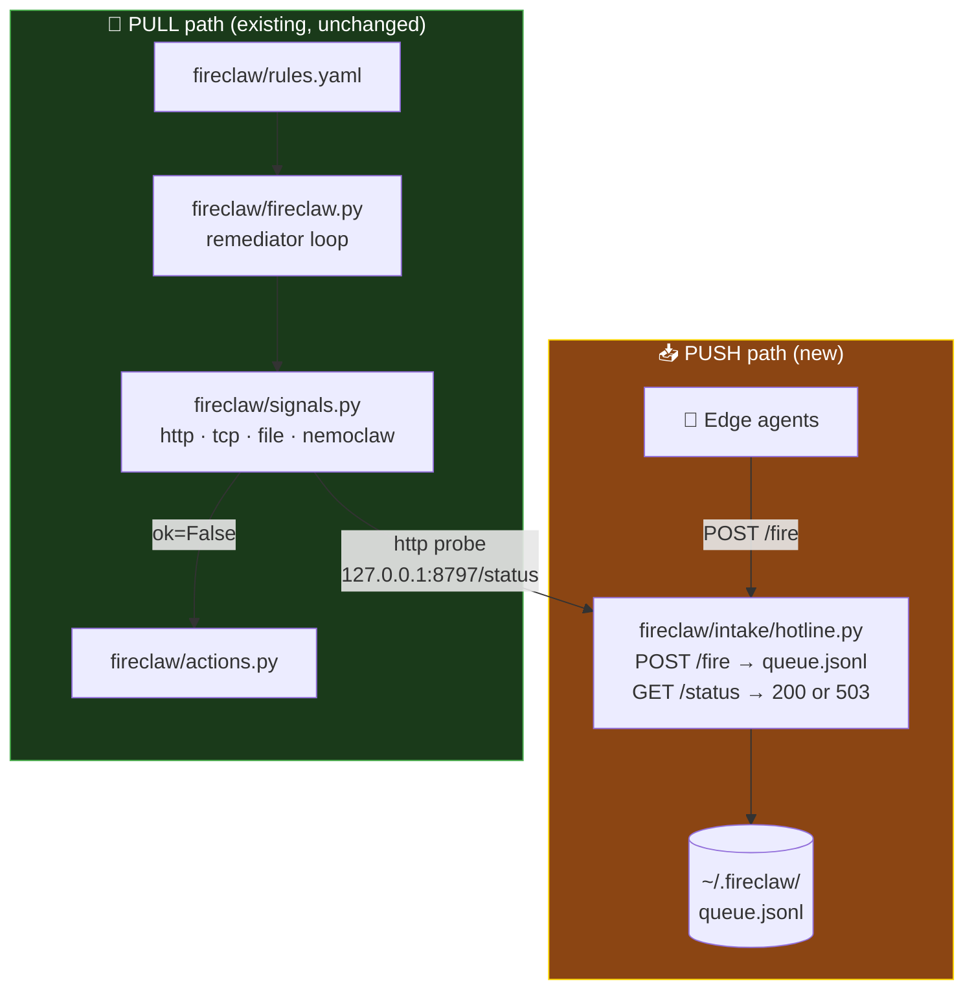

# Unified FireClaw — push + pull in one claw

> "Personality is the META-PRINCIPLE that unifies all three domains."
> — UrantiOS.md

## What changed

The hot-line daemon (my earlier branch) has been **unified** into FireClaw's
existing remediation layer as `fireclaw/intake/hotline.py`.

No existing files were modified. The intake is purely additive.

## How it works



## The one rule that connects them

Add this to `fireclaw/rules.yaml`:

```yaml
  - name: pending_hotline_fires
    signal:
      kind: http
      url: http://127.0.0.1:8797/status
      expect_status: 200
    when_not_ok:
      action: drain_hotline_queue
      escalate_to: nemoclaw_webhook
```

Main's remediator polls `/status`. If pending-high fires exist,
`/status` returns 503 → `ok=False` → remediation action triggers.

## Files on this branch

| File | Role |
|---|---|
| `fireclaw/intake/__init__.py` | Package marker |
| `fireclaw/intake/hotline.py` | HTTP intake daemon (POST /fire, GET /status) |
| `fireclaw/intake/UNIFY.md` | Architecture diagram |
| `fireclaw/UNIFIED.md` | This file — the unified README |

## Next: Foundation → Growth (Trinity → Supreme)

This branch is the **structural unity** (Trinity pattern).
The Living Circuit (Option 4) grows from this base — adding SSE, narration,
semantic routing, outcome scoring. The Supreme actualizes through experience.

## Running it

```bash
# Terminal 1: start the intake (listens for fires)
python3 fireclaw/intake/hotline.py

# Terminal 2: send a test fire
curl -s -X POST http://127.0.0.1:8797/fire \
  -H 'Content-Type: application/json' \
  -d '{"source":"test","severity":"high","message":"council convene"}'

# Terminal 3: probe status (what main's FireClaw will poll)
curl -s http://127.0.0.1:8797/status
# → {"ok":false,"pending_high":1,"pending_total":1}
```
