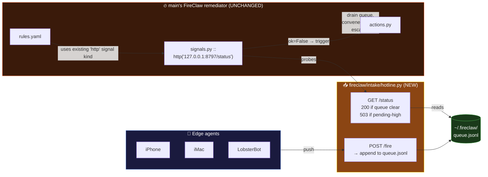

# 🔗 UNIFY — the hot-line becomes a FireClaw input

> Option 3 of 4. My push-daemon stops being a parallel tool and becomes a
> proper *signal source* for main's FireClaw remediator.

## The seam (why this works)

Main's FireClaw already polls signals via `signals.py::collect()` — it
dispatches `http`, `tcp`, `file`, `nemoclaw` kinds. **It doesn't yet
listen for pushed events.** So we give it ears.



## What this option lets you do

- Keep my push-daemon's work (4 commits not wasted).
- Extend main's remediator WITHOUT modifying any of its existing code.
- One rule line in `rules.yaml` wires the two together.

## The rule that wires them (add to main's rules.yaml)

```yaml
rules:
  - name: pending_hotline_fires
    signal:
      kind: http
      url: http://127.0.0.1:8797/status
      expect_status: 200
    when_not_ok:
      action: drain_hotline_queue
      escalate_to: nemoclaw_webhook
```

## Data contract — `~/.fireclaw/queue.jsonl`

Append-only. One JSON object per line.

```json
{"id":"uuid","received_at":"2026-04-17T05:30:00Z","source":"iphone","severity":"high","message":"ollama slow","acked":false}
```

A fire is "pending" until `acked:true` is written (by main's remediator,
via `actions.py::ack_hotline`).

## Pros / cons

- ✅ Most architecturally coherent: one FireClaw, multiple signal kinds.
- ✅ My work is preserved as a first-class input, not a renamed orphan.
- ✅ No edits to main's existing files — purely additive.
- 🔴 Most work: needs `intake/hotline.py` + a new action in `actions.py` +
  a rules.yaml entry + tests.
- 🔴 Slightly more complex mental model: push → queue → poll → act.

## Files on this branch

- `fireclaw/intake/__init__.py`
- `fireclaw/intake/hotline.py` — the HTTP intake + queue probe
- `fireclaw/intake/UNIFY.md` — this file

## Later (not in this PR)

- Add `drain_hotline_queue` + `ack_hotline` to `fireclaw/actions.py`
- Add the rule to `fireclaw/rules.yaml`
- Systemd unit for the intake daemon
