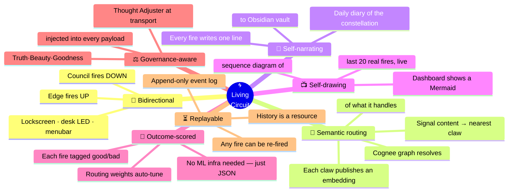
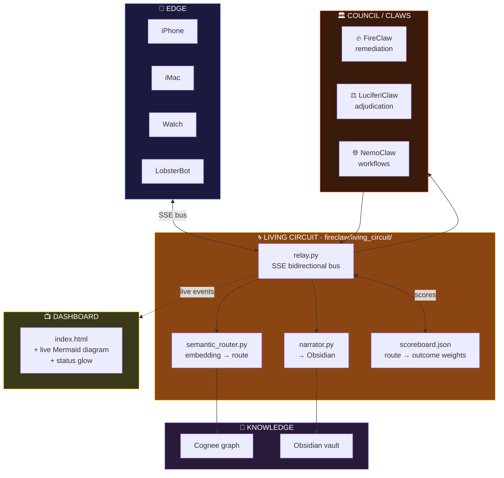
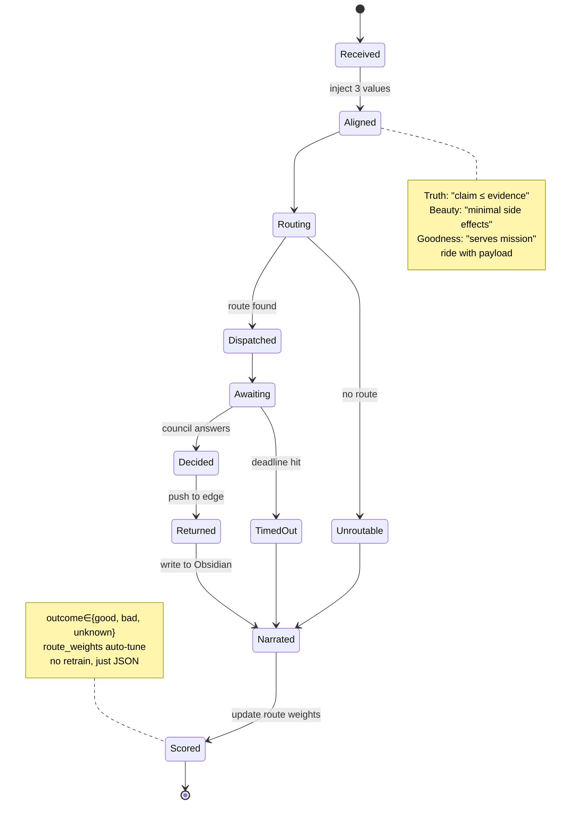
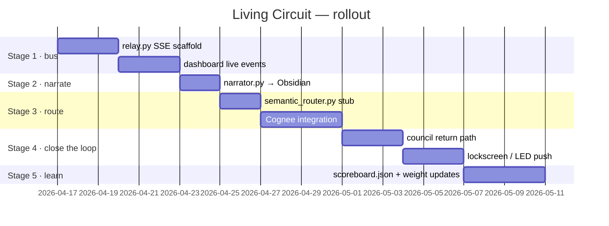

# 🌀 The Living Circuit — FireClaw as a nervous system

> Option 4 of 4. Not a forwarder, not a remediator, not a union of the two.
> A **closed-loop, semantic, self-narrating, self-drawing nervous system**.
> Opens new capability space — not just tidier code.

## The seven senses of the Living Circuit



## How a fire travels — full round-trip

```mermaid
sequenceDiagram
    autonumber
    participant Ed as 📱 Edge (Mircea)
    participant LC as 🌀 Living Circuit<br/>(fireclaw/living_circuit/relay.py)
    participant SR as 🧬 Semantic Router<br/>(semantic_router.py)
    participant Cg as 🧬 Cognee<br/>graph
    participant Cl as 🏛️ Council
    participant Nr as 📜 Narrator<br/>(narrator.py)
    participant Ob as 💎 Obsidian
    participant Da as 📺 Dashboard<br/>(SSE /stream)

    Ed->>LC: POST /fire {text:"Ollama feels slow"}
    LC->>LC: inject Truth·Beauty·Goodness
    LC->>SR: route(payload)
    SR->>Cg: embed(text), nearest_route()
    Cg-->>SR: route="ai-ops", score=0.87
    SR-->>LC: route
    LC->>Cl: dispatch via ai-ops
    LC->>Da: SSE event: {phase:"dispatched"}
    Cl-->>LC: decision: restart qwen container
    LC->>Ed: 🔔 lockscreen push: "done — 12s downtime"
    LC->>Nr: narrate(fire, outcome)
    Nr->>Ob: append "14:23 — ollama slow; restarted; OK."
    LC->>Da: SSE event: {phase:"resolved", outcome:"good"}
    LC->>LC: route_weight["ai-ops"] += 0.01
```

## System context (zoom out)



## A fire's life as a state machine



## Build stages (what I'd ship, in order)



## Pros / cons

- ✅ **Genuinely new capability** — closed-loop, semantic, self-documenting.
- ✅ Each stage ships value on its own (live dashboard is useful even without
  routing; routing is useful even without scoring).
- ✅ Every stage is audit-friendly (append-only log, visible diagrams).
- 🔴 Multi-week effort, spread across 5 PRs.
- 🔴 Requires Cognee integration to reach its full form.
- 🟡 Some parts (desk LED, haptic push) need real-world hardware choices
  before shipping.

## Files currently on this branch

- `fireclaw/living_circuit/ARCHITECTURE.md` — this file
- `fireclaw/living_circuit/relay.py` — stage-1 SSE relay (minimal scaffold)

The rest (narrator, router, scoreboard, council-return, lockscreen) ship
in follow-up PRs, *iff* you pick Option 4.
