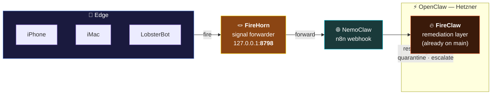

# 🪢 FireHorn — the signal horn

> Option 1 of 4 for resolving the FireClaw naming conflict.
> Open this file on GitHub — the diagram renders automatically.

## What this option looks like



## What changes vs. today

| Thing | Before | After |
|---|---|---|
| Repo path (push daemon) | `setup/fireclaw/` on my PR branch | **`firehorn/`** at repo root |
| Name in code | `FireClaw` | **`FireHorn`** |
| Port | 8797 | **8798** (so both can run) |
| Role | "hot-line forwarder" (conflicted with remediation) | **signal horn** (clearly an input tool) |
| Repo path (remediation) | `fireclaw/` on main | `fireclaw/` on main (unchanged) |

## Pros / cons

- ✅ Easy — a clean rename. No architectural work.
- ✅ Safe — both tools live side by side, no collision.
- ✅ Clear naming: **horn** = blow it, somebody hears. **claw** = grab & act.
- 🟡 Two names to remember.
- 🟡 No new capability — just organizational hygiene.

## Files in this option

- `firehorn/firehorn.py` — the daemon (renamed from my hot-line forwarder)
- `firehorn/README.md` — this file

## How to see it running

```bash
git checkout claude/fireclaw-opt1-firehorn
python3 firehorn/firehorn.py
# in another terminal:
curl -X POST http://127.0.0.1:8798/fire \
  -H 'Content-Type: application/json' \
  -d '{"severity":"high","message":"test horn"}'
```
