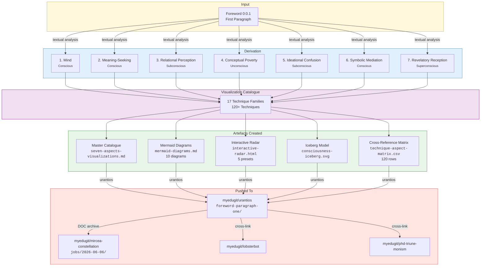
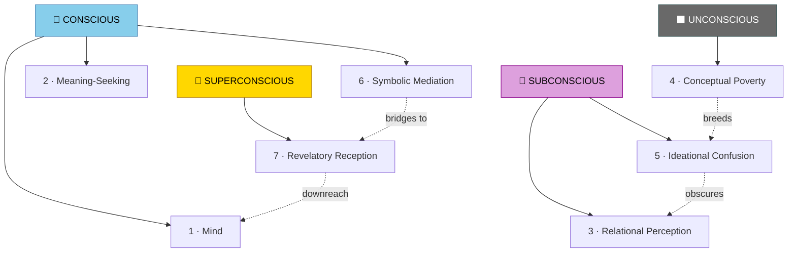

# DOC Diagram — Seven Aspects Visualization Job

```mermaid
flowchart TD
    subgraph INPUT["Input"]
        P["Foreword 0:0.1<br/>First Paragraph"]
    end

    subgraph DERIVATION["Derivation"]
        P -->|"textual analysis"| A1["1. Mind<br/><small>Conscious</small>"]
        P -->|"textual analysis"| A2["2. Meaning-Seeking<br/><small>Conscious</small>"]
        P -->|"textual analysis"| A3["3. Relational Perception<br/><small>Subconscious</small>"]
        P -->|"textual analysis"| A4["4. Conceptual Poverty<br/><small>Unconscious</small>"]
        P -->|"textual analysis"| A5["5. Ideational Confusion<br/><small>Subconscious</small>"]
        P -->|"textual analysis"| A6["6. Symbolic Mediation<br/><small>Conscious</small>"]
        P -->|"textual analysis"| A7["7. Revelatory Reception<br/><small>Superconscious</small>"]
    end

    subgraph CATALOGUE["Visualization Catalogue"]
        A1 & A2 & A3 & A4 & A5 & A6 & A7 --> FAM["17 Technique Families<br/>120+ Techniques"]
    end

    subgraph ARTEFACTS["Artefacts Created"]
        FAM --> MD["Master Catalogue<br/><code>seven-aspects-visualizations.md</code>"]
        FAM --> MER["Mermaid Diagrams<br/><code>mermaid-diagrams.md</code><br/>10 diagrams"]
        FAM --> HTML["Interactive Radar<br/><code>interactive-radar.html</code><br/>5 presets"]
        FAM --> SVG["Iceberg Model<br/><code>consciousness-iceberg.svg</code>"]
        FAM --> CSV["Cross-Reference Matrix<br/><code>technique-aspect-matrix.csv</code><br/>120 rows"]
    end

    subgraph REPOS["Pushed To"]
        MD & MER & HTML & SVG & CSV -->|"urantios"| U["myedugit/urantios<br/><code>foreword-paragraph-one/</code>"]
        U -->|"DOC archive"| MC["myedugit/mircea-constellation<br/><code>jobs/2026-06-06/</code>"]
        U -->|"cross-link"| LB["myedugit/lobsterbot"]
        U -->|"cross-link"| PhD["myedugit/phd-triune-monism"]
    end

    style INPUT fill:#FFF8DC,stroke:#DAA520
    style DERIVATION fill:#E0F0FF,stroke:#4682B4
    style CATALOGUE fill:#F0E0F0,stroke:#8B008B
    style ARTEFACTS fill:#E8F5E8,stroke:#228B22
    style REPOS fill:#FFE4E1,stroke:#CD5C5C
```

## Consciousness Tier Mapping

```mermaid
graph TD
    SUPER["🔆 SUPERCONSCIOUS"] --> A7["7 · Revelatory Reception"]
    CON["🧠 CONSCIOUS"] --> A1["1 · Mind"]
    CON --> A2["2 · Meaning-Seeking"]
    CON --> A6["6 · Symbolic Mediation"]
    SUB["🌊 SUBCONSCIOUS"] --> A3["3 · Relational Perception"]
    SUB --> A5["5 · Ideational Confusion"]
    UNC["⬛ UNCONSCIOUS"] --> A4["4 · Conceptual Poverty"]

    A7 -.->|"downreach"| A1
    A4 -.->|"breeds"| A5
    A5 -.->|"obscures"| A3
    A6 -.->|"bridges to"| A7

    style SUPER fill:#FFD700,stroke:#B8860B,color:#000
    style CON fill:#87CEEB,stroke:#4682B4,color:#000
    style SUB fill:#DDA0DD,stroke:#8B008B,color:#000
    style UNC fill:#696969,stroke:#2F4F4F,color:#FFF
```
