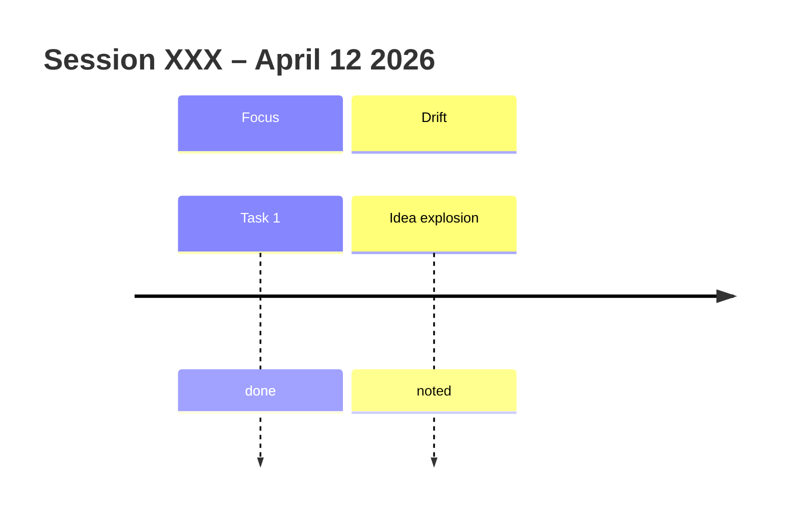

# Grandfather's Axe – Refined Session Logging Format (v2)

## Template (copy this every time)

```markdown
# GA Memory — Session XXX (Date & Time)

**Trigger:** What started the moment
**Reaction:** How you felt/responded
**Vector:** The drift pattern
**Value:** Why it matters
**Design note:** How GA app should handle it

**Reward:** (e.g. +12 minutes streak praise)
**Rabbit hole links:** [[n8n_Expansion_Plan]] • [[Obsidian_Sync_Options_2026]]

**Mermaid timeline:**

```

## Why this is better
- One template = consistent memory
- Built-in reward system
- Automatic mermaid timeline
- Clickable links so you can navigate rabbit holes and always return

**Auto-log rule for GA bot:** Every time Claude detects a drift pattern, it creates a new note using this exact template.
