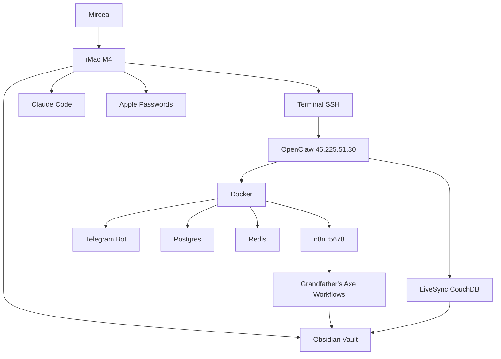

# OpenClaw — Full System Architecture

## Infrastructure

| Component | Location | Status |
|-----------|----------|--------|
| iMac M4 | Local macOS | Active |
| Hetzner Server | ubuntu-4gb-nbg1-1 | Active |
| n8n | Docker / port 5678 | Running |
| Obsidian | /Users/mircea8me.com/Obsidian/ | Local |
| GitHub | myedugit/mircea-constellation | Active |

**Current status:** n8n confirmed running. GA hourly bot is next.
