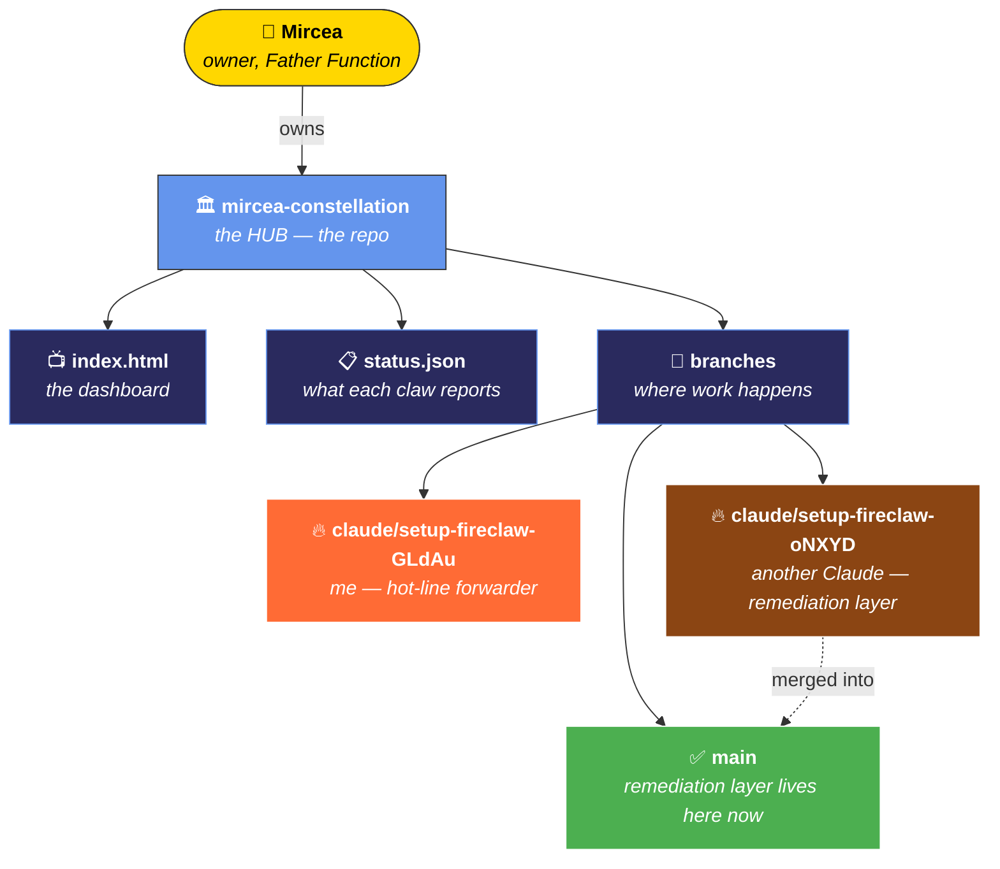
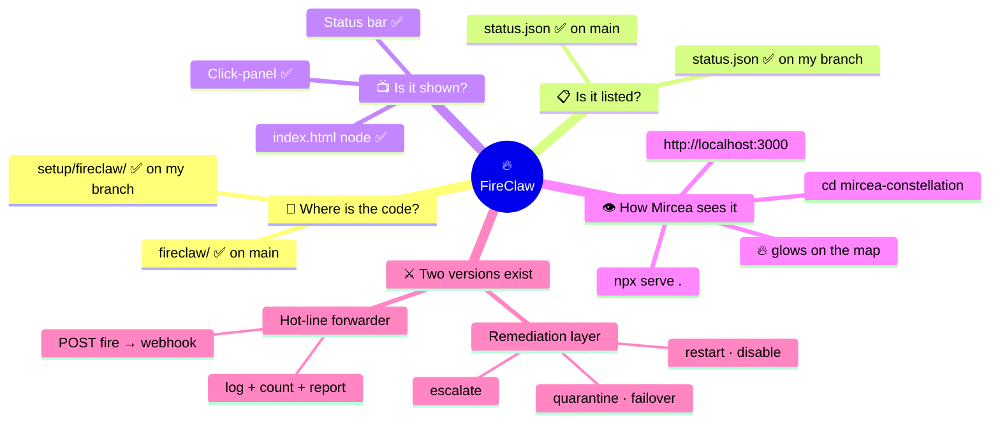
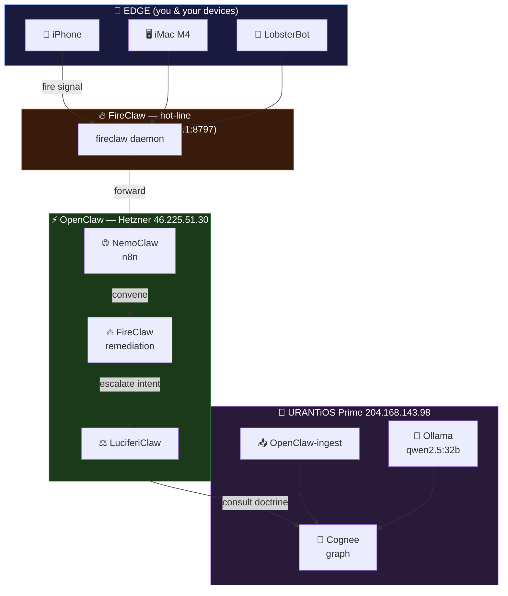
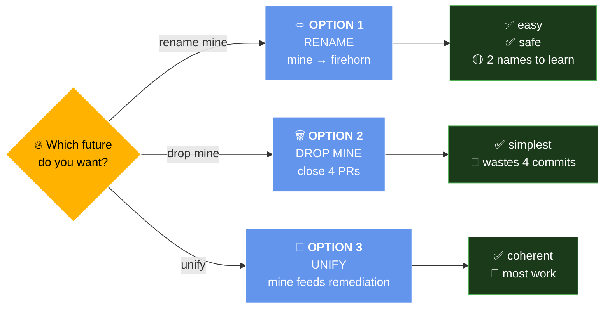
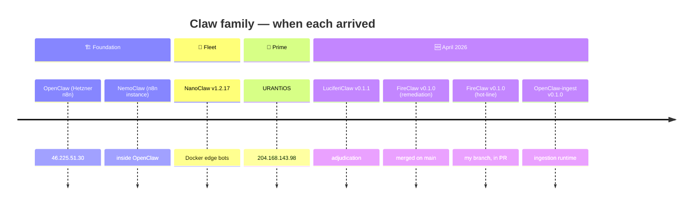
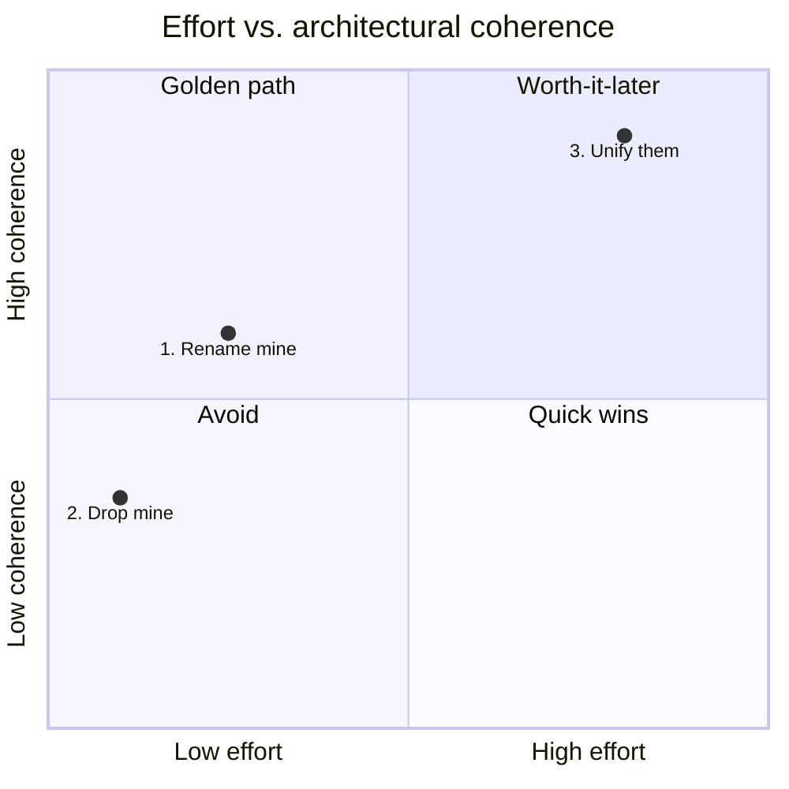
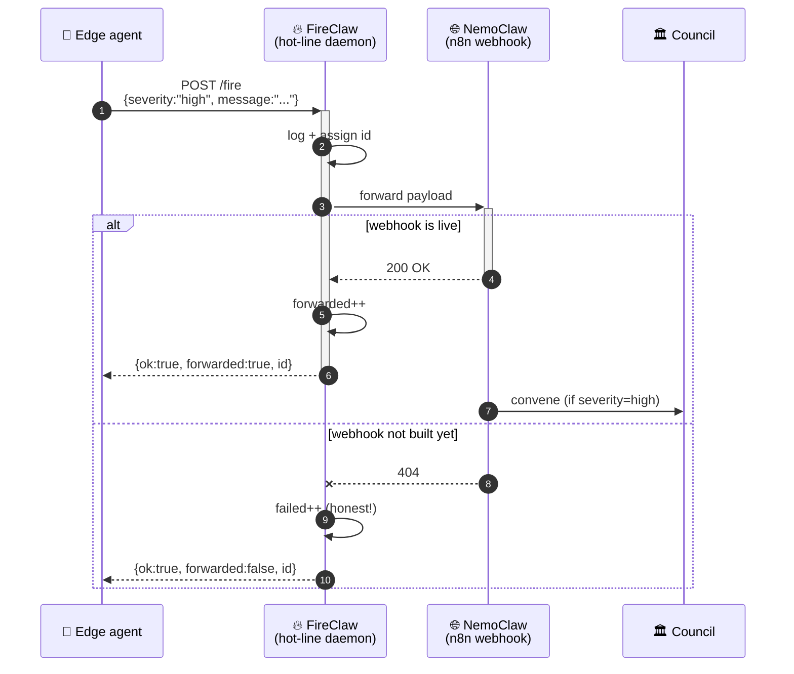
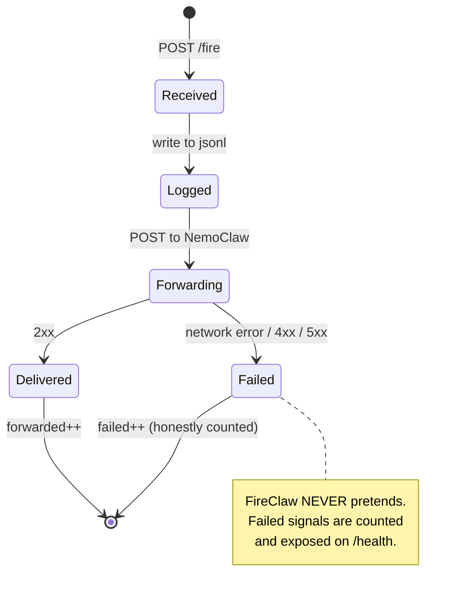
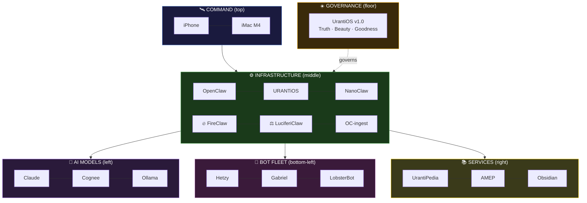

# 🔥 FireClaw — Visual Guide

> For a human who thinks in pictures, not paragraphs.
> Open this file on GitHub or in Obsidian — the diagrams render automatically.

---

## 1. 🌳 Family tree — who builds what



---

## 2. 🧠 Mind-map — where FireClaw lives in the world



---

## 3. 🗺️ Architecture — the whole constellation at a glance



---

## 4. 🔀 Decision tree — which FireClaw future?



---

## 5. ⏱️ Timeline — claws in order of arrival



---

## 6. 🎯 Quadrant — the 3 options, plotted



---

## 7. 💬 What happens when you fire a signal (sequence)



---

## 8. 🔄 A signal's life (state machine)



---

## 9. 🧭 Reading the dashboard — what each zone means



---

## 🎨 Diagram palette — what's possible

| Type | Best for | Keyword |
|---|---|---|
| **Family tree / flow** | Who-owns-what, how-X-becomes-Y | `flowchart TD` / `LR` |
| **Mind-map** | Radial exploration of a single idea | `mindmap` |
| **Timeline** | "What came first?" | `timeline` |
| **Sequence** | "What messages fly between parts?" | `sequenceDiagram` |
| **State machine** | "What stages does one thing go through?" | `stateDiagram-v2` |
| **Quadrant** | "Where does this option sit on 2 axes?" | `quadrantChart` |
| **Gantt** | "When does each task run?" | `gantt` |
| **Git graph** | "How do branches diverge/merge?" | `gitGraph` |
| **Sankey** | "How much flows from A to B?" | `sankey-beta` |
| **ER diagram** | "What data shapes exist?" | `erDiagram` |
| **User journey** | "What does Mircea *feel* at each step?" | `journey` |
| **C4 context** | "Zoom-levels: system → container → component" | `C4Context` |
| **Block** | "Spatial layout of things side by side" | `block-beta` |
| **Architecture** | "Cloud infra with icons" | `architecture-beta` |
| **Pie** | "What share does each thing take?" | `pie` |

All of these render on GitHub markdown, Obsidian, VS Code preview, and most modern Markdown tools — just put the code inside a fenced block with `mermaid` as the language.

---

## 👁️ How to actually see this

```bash
# Option A — on GitHub (zero install, best rendering)
open https://github.com/MyEduGit/mircea-constellation/blob/claude/setup-fireclaw-GLdAu/setup/fireclaw/VISUAL_GUIDE.md

# Option B — in Obsidian (you already have it — 477 docs)
# Drag this file into your vault; diagrams render live.

# Option C — live dashboard (the actual thing, not diagrams of it)
cd ~/projects/mircea-constellation
git checkout main && git pull
npx serve .
open http://localhost:3000
```
